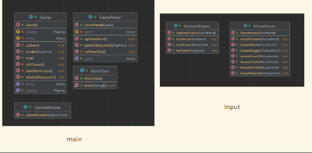
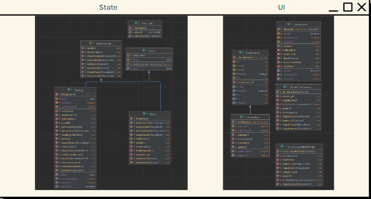
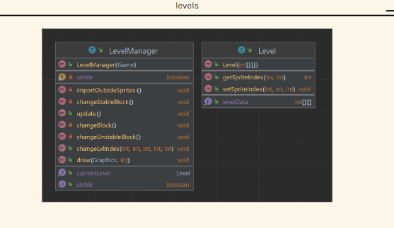
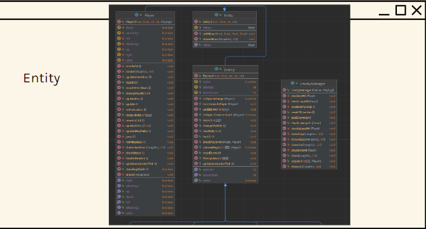
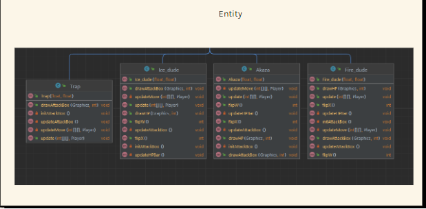
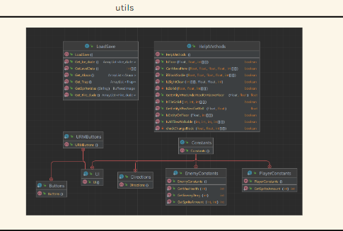

# OOP-Project-game-java
<h1 align="center"> Demon Slayer </h1>
<h3 align="center"> HCMIU - OOP Final Project - Semester 2 2022 - 2023 </h3>

<!-- TABLE OF CONTENTS -->
<h2 id="table-of-contents"> :book: Table of Contents</h2>

  
Table of Contents

  <ol>
    <li><a href="#about-the-game"> ➤ About The Game</a>
      <ol>
        <li><a href="#intro"> Introduction</a></li>
        <li><a href="#rules"> Rules</a></li>
        <li><a href="#demo"> Demo</a></li>
      </ol>
    </li>
    <li><a href="#about-the-project"> ➤ About The Project</a>
      <ol>
        <li><a href="#built-with"> Built With</a></li>
        <li><a href="#uml"> UML</a></li>
        <li><a href="#probs"> Original source code problems</a></li>
        <li><a href="#upgraded-features"> Upgraded Features</a></li>
        <li><a href="#future-features"> Future Features</a></li>
        <li><a href="#challenges"> challenges</a></li>
        <li><a href="#tasks-allocation"> Tasks Allocation</a></li>
      </ol>
    </li>
    <li><a href="#references"> ➤ References</a></li>
    <li><a href="#contributors"> ➤ Contributors</a></li>
  </ol>

<!-- ABOUT THE GAME -->
<h2 id="about-the-game"> :cloud: About The Game</h2>

<h3 id="intro"> Introduction </h3>

 
  The game was inspired by the anime movie with the same name Demon Slayer (Kimetsu no Yaba) which had been releashed recently. This 2D-Flatform game is the journey where player becomes Tanjiro and use his skill and power to defeats all the demons. 

<h3 id="rules"> Rules </h3>
  
<h3 id="demon"> Demon </h3>
  
  
<h3 id="gameplay"> Gameplay </h3>
  

<!-- ABOUT THE PROJECT -->
<h2 id="about-the-project"> :pencil: About The Project</h2>

<h3 id="built-with"> Built With </h3>
  <ul>
    <li>IDE: IntelliJ IDEA</li>
    <li>Language: Java</li>
    <li>Library: standard Java libraries, JavaFX (for sound feartures)</li>
    <li>Tools: Paint / Adobe Photoshop CS6 / Canvas (design particular objects)</li>
  </ul>
  
  
<h3 id="uml"> UML </h3>
  
  
  
  
  
  
  
  
<h3 id="probs"> Original source code problems </h3>
  <ul>
    <li>The bullets go through the  wall </li>
    <li>Bugs in the physical map lead to some situation that the main character can go through the wall and fall outside the map</li>
    <li>Single round</li>
    <li>Non user-friendly interface</li>
  </ul>
  
<h3 id="upgraded-features"> Upgraded Features </h3>
  <ul>
    <li>Creat blocks that can disappear</li>
    <li>Design a better looking user interface (Main menu, Rules menu, Pause menu, loading screen)</li>
    <li>Add a new boss Azaka (the appearance, skills, animations)</li>
    <li>Create creative mode</li>
    <li>Modify blood and damage of enemies logically</li>
  </ul>
  
<h3 id="future-features"> Future Features </h3>
  <ul>
    <li>Add a longer/ wider map</li>
    <li>Multiple round</li>
  </ul>
  
<h3 id="challenges"> Challenges </h3>
  <ul>
    <li>Lack of appropriate data resources (maps, sprites)</li>
    <li>Smoothen frame transition</li>
  </ul>
  

<!-- REFERENCES -->
<h2 id="references"> :scroll: References </h2>
<a href="https://www.youtube.com/watch?v=6_N8QZ47toY"> Youtube - Kaarin Gaming</a> 

<!-- CONTTRIBUTORS -->
<h2 id="contributors"> :small_orange_diamond: Contributors</h2>

**Nguyễn Đặng Minh Đức - ITCSIU21050**  
**Nguyễn Huy Hùng - ITCSIU21064**       
**Trần Quang Bảo DUy - ITCSIU21176**  
**Phạm Anh Huy - ITCSIU21133**  
**Trần Minh Phương - ITITIU21286**
